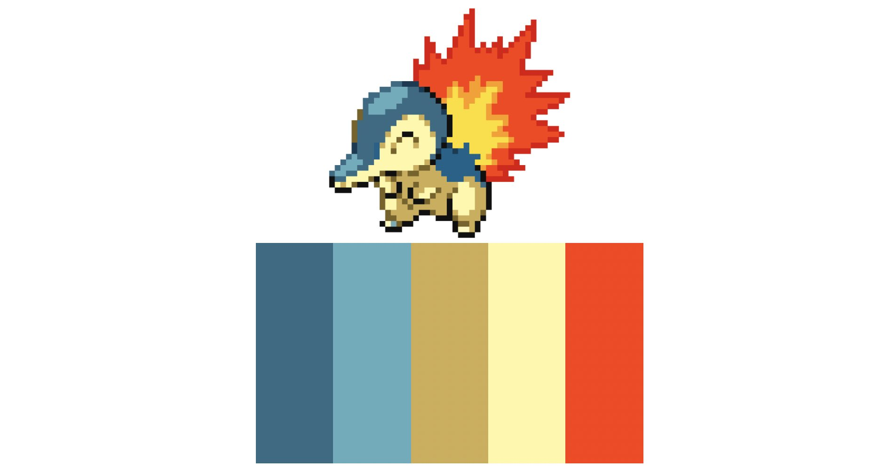
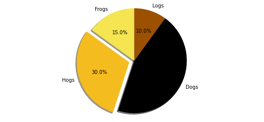
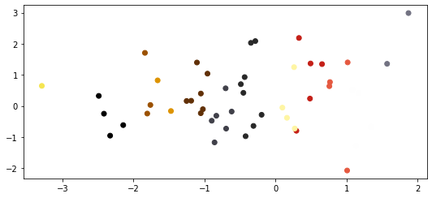

# pokepalette
> A simple pokemon color chooser


" [](https://pypi.org/project/pokepalette/#description) 


This repo is based on [CDWimmer/PokePalette](https://github.com/CDWimmer/PokePalette) 

## Install

```bash
pip install pokepalette
```

## How to use

```python
import numpy as np
import matplotlib.pyplot as plt

import pokepalette
```

There is a handy `SimpleNamespace` with all the pokemons and their colours available:

```python
pokepalette.PokemonColours.pikachu
```


    ['#f5e551',
     '#f5bc1f',
     '#000000',
     '#9b5100',
     '#dd9300',
     '#613007',
     '#404049',
     '#282828',
     '#fef5a3',
     '#c41f17',
     '#e55940',
     '#fefefe',
     '#727282']


```python
pikachu_cmap = pokepalette.get_colormap('pikachu')
```

You can plot passing the `pikachu` colors directly

```python
# Pie chart, where the slices will be ordered and plotted counter-clockwise:
labels = 'Frogs', 'Hogs', 'Dogs', 'Logs'
sizes = [15, 30, 45, 10]
explode = (0, 0.1, 0, 0)  # only "explode" the 2nd slice (i.e. 'Hogs')

fig1, ax1 = plt.subplots()
ax1.pie(sizes, colors=pokepalette.PokemonColours.pikachu, explode=explode, labels=labels, autopct='%1.1f%%',
        shadow=True, startangle=90)
ax1.axis('equal')  # Equal aspect ratio ensures that pie is drawn as a circle.

plt.show()
```





or passing the corresponding matplotlib's colormap

```python
plt.rcParams["figure.figsize"] = [7.50, 3.50]
plt.rcParams["figure.autolayout"] = True

N = 50
x = np.random.randn(N)
y = np.random.randn(N)

plt.scatter(x, y, c=x, cmap=pikachu_cmap)

plt.show()
```




